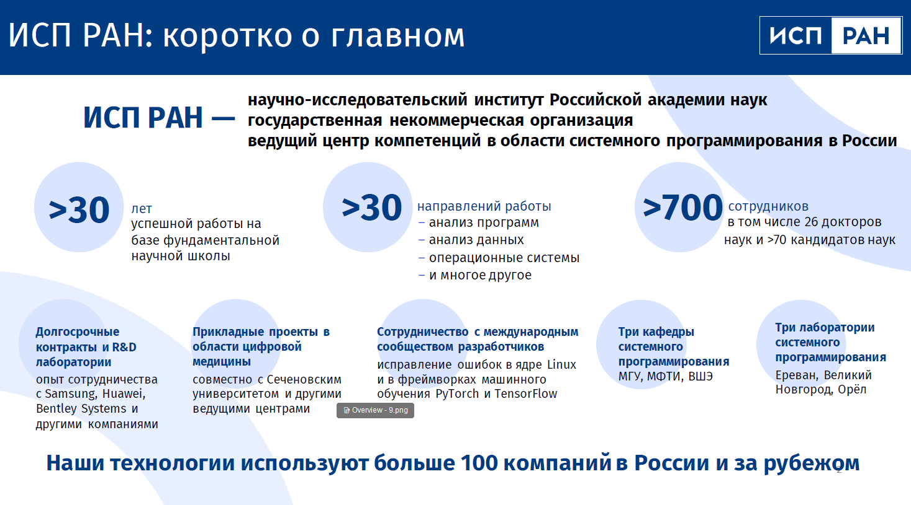
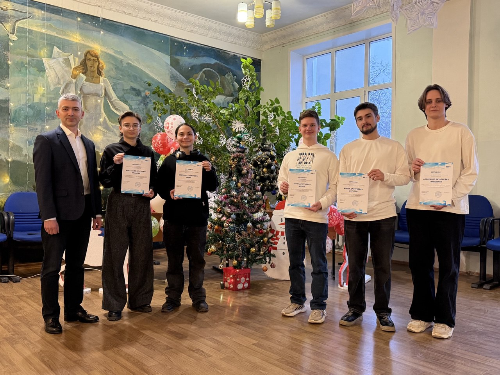
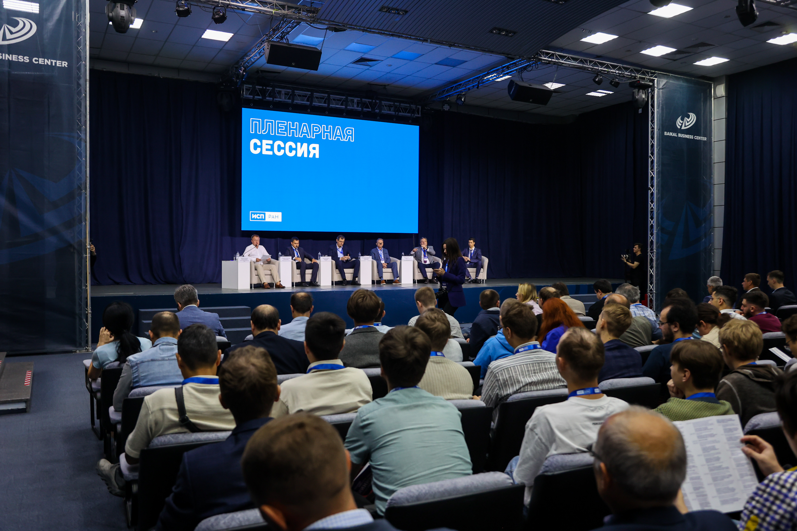

# ИСП РАН + ОГУ

## Что предлагает ИСП РАН студентам ОГУ?

Официальный сайт Института системного программирования имени Виктора Петровича Иванникова Российской академии наук (ИСП РАН): [https://www.ispras.ru/](https://www.ispras.ru/)

Адрес этой страницы: [https://oreluniver.ispras.ru](http://oreluniver.ispras.ru)

Канал ИСП РАН в Telegram: [@ispras](https://t.me/ispras)

Скачать презентацию в PDF: [ИСП РАН для студентов](https://nextcloud.ispras.ru/index.php/s/iYCpNBLEpSKrTR7)

Страница ИСП РАН для студентов: [https://education.at.ispras.ru/](https://education.at.ispras.ru/)

## Направления подготовки

С 2024 года сотрудники ИСП РАН проводят занятия в ОГУ для студентов следующих направлений подготовки:

- 01.03.02 "Прикладная математика и информатика" (ПМ)
- 09.03.01 "Информатика и вычислительная техника" (ИВТ)
- 09.03.02 "Информационные системы и технологии" (ИТ)
- 09.03.03 "Прикладная информатика" (ПИ)
- 09.03.04 "Программная инженерия" (ПГ)

Занятия проводят сотрудники ИСП РАН — разработчики технологии ML IDS [https://www.ispras.ru/technologies/ml_ids/](https://www.ispras.ru/technologies/ml_ids/) — Дмитрий Александрович Рыболовлев [@fish_boned](https://t.me/fish_boned) и Анастасия Григорьевна Никольская.

## Охват групп по годам

| **Группа** | **Дисциплина / модуль** | **Количество часов** | **Индивидуальные проекты** |
| --- | --- | --- | --- |
|  | **2024 год, осенний семестр** |  |  |
| **31ИВТ** (2 г.о.) | Проектная деятельность | 12 |  |
| **31ПГ** (2 г.о.) | Проектная деятельность | 12 |  |
| **32ПГ** (2 г.о.) | Проектная деятельность | 12 |  |
| **21ПИ** (3 г.о.) | Разработка профессиональных приложений | 12 | Алиса Кузнецова, Антон Ветров, Александр Тимошенко. **Разработка AI-ассистента для решения задач обеспечения информационной безопасности.** Роман Шугуров. **Монитор событий информационной безопасности.** |
|  | **2025 год, весенний семестр** |  |  |
| **31ПИ** (2 г.о.) | Проектная деятельность | 16 | Ярослав Захаров, Дмитрий Караванов, Степан Мыльников. **LLM from Scratch.** |
| **31ПГ** (2 г.о.) | Проектная деятельность | 8 |  |
| **21ИТ** (3 г.о.) | Введение в технологии искусственного интеллекта | 56 | **Разработка методов атак против моделей машинного обучения.** Светлана Баева, Анастасия Ртищева. |
| **21ПИ** (3 г.о.) | Основы искусственного интеллекта | 36 | Антон Ветров 🎓. **Платформа для тестирования и сравнения языковых моделей.** Александр Тимошенко 🎓. **Сравнительный анализ современных больших языковых моделей для интерпретации логов систем обнаружения вторжений.** Роман Шугуров 🎓. **Обнаружение веб-атак с использованием методов машинного обучения.** |
|  | **2025 год, осенний семестр** |  |  |
| **21ПМ** (4 г.о.) | Математическое моделирование | 8 |  |
| **21ПИ** (4 г.о.) | — | — | Антон Ветров 🎓 Александр Тимошенко 🎓 Роман Шугуров 🎓 |
| **21ИТ** (4 г.о.) | — | — | Светлана Баева 🎓 Анастасия Ртищева 🎓 |
| **41ИВТ** (2 г.о.) | Проектная деятельность | 12 |  |
| **41ИТ** (2 г.о.) | Проектная деятельность | 12 |  |
| **41ПГ** (2 г.о.) | Проектная деятельность | 12 | Андрей Анисимов, Александр Струков, Дмитрий Костин. **Разработка большой языковой модели для поиска в области ИИ.** Андрей Шестерненков. **Исследование ML-модели open-appsec.** |
|  | **2026 год, весенний семестр** |  |  |
| **21ПИ** (4 г.о.) | — | — | Антон Ветров 🎓 Александр Тимошенко 🎓 |
| **21ИТ** (4 г.о.) | — | — | Светлана Баева 🎓 Анастасия Ртищева 🎓 |
| 31ПМ (3 г.о.) | Проектная деятельность в программировании и научных вычислениях | 48 |  |
| 31ПИ (3 г.о.) | Основы искусственного интеллекта | 36 |  |
| **41ПИ** (2 г.о.) | — | — |  |

## Новости

**25.12.2025** На заседании Учёного совета ОГУ состоялось торжественное вручение сертификатов на получение стипендий ИСП РАН студентам ИПАИТ:

- [На Учёном совете ОГУ имени И.С. Тургенева подвели итоги года.](https://oreluniver.ru/media/news/show/1/27576)
- [Студенты ОГУ имени И.С. Тургенева стали стипендиатами программы Института системного программирования РАН.](https://oreluniver.ru/media/news/show/1/27611)

**17.12.2025** Состоялась защита студенческих проектов в группе 41ПГ.

**09.12.2025** Студенты ИПАИТ — Антон Ветров, Александр Тимошенко, Светлана Баева и Анастасия Ртищева — приняли участие в работе [Открытой конференции ИСП РАН 2025](https://www.isprasopen.ru/2025/) в кластере “Ломоносов”, г. Москва.

  
  
  

**26.06.2025** В Иркутске прошла ежегодная конференция ИСП РАН ["Иванниковские чтения"](https://ivannikov-ws.org/), посвящённая разработке инновационных технологий системного программирования и искусственного интеллекта.

  
  
  
  

**05.06.2025** Студенты группы 21ПИ Антон Ветров, Александр Тимошенко, Роман Шугуров выступили с докладами на конференции [ИТНОП-2025](https://myconfs.ru/itnop2025). Александр Тимошенко получил диплом II степени в секции "Искусственный интеллект и принятие решений".

**01.06.2025** Среди восьмисот заявок Дмитрий Рыболовлев с коллегами стали победителями [Технотекста года](https://habr.com/ru/companies/habr/articles/911650/) в номинации "AI & ML" со своей статьей ["Я больше не верю публичным датасетам"](https://habr.com/ru/companies/isp_ras/articles/829506/) о том, с какими проблемами они сталкиваются при обучении систем обнаружения компьютерных атак на публичных данных.

**31.05.2025** https://oreluniver.ru/media/news/show/1/25591

**18.12.2024** Состоялась защита студенческих проектов в группе 21ПИ.

  
  

**07.10.2024** В Университете "Сириус" стартовала проектная смена "Доверенный искусственный интеллект". Обучение проходят около 40 студентов и аспирантов, а в качестве преподавателей выступают ведущие сотрудники ИСП РАН, МГУ им. М.В. Ломоносова, МФТИ, ННГУ, Сколтеха, AIRI и Университета Иннополис. Среди преподавателей — Дмитрий Александрович Рыболовлев и Анастасия Григорьевна Никольская.

**23.11.2022** Заключено Соглашение о сотрудничестве между ИСП РАН и ОГУ**.**

**26.09.2020** https://oreluniver.ru/media/news/show/1/9626

https://www.ivannikov-ws.org/2020/#AboutEvent

  
  

